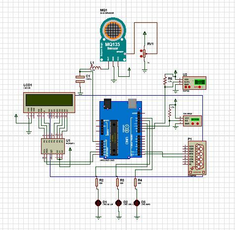

# 🌡️ Air Quality and Temperature Monitoring System

## 📜 Overview
This project is an **Air Quality and Temperature Monitoring System** with **Arduino Uno**, **DS18B20**, **DHT22**, and **MQ135**, to measure environmental parameters such as temperature and air quality. The data is displayed on a PyQt5-based graphical user interface (GUI), enabling real-time monitoring and analysis.

## 🏗️ Project Structure
The project consists of three main components:

1. **Arduino Code**: Reads data from the DS18B20, DHT22, and MQ135 sensors and sends it via serial communication.
2. **PyQt5 Interface**: Displays real-time sensor data and plots on a desktop application.
3. **Proteus Simulation**: Simulates the hardware circuit before deployment.

## 🧩 Components Used
- **DS18B20**: Temperature sensor
- **DHT22**: Temperature and humidity sensor
- **MQ135**: Air quality sensor
- **Arduino**: Microcontroller for reading sensor data
- **PyQt5**: GUI framework for desktop application
- **PyQtGraph**: For real-time plotting
- **Proteus**: Circuit simulation software

## 🏅 Features
- Real-time data visualization with PyQtGraph
- Monitors multiple environmental parameters
- Circuit simulation with Proteus
- User-friendly GUI with PyQt5

## 🛠️ Installation
1. Clone the repository:
   ```bash
   git clone https://github.com/HanMade-Dev/Sistem-Pendeteksi-Suhu-dan-Kualitas-Udara.git
   ```
2. Navigate to the project directory and install required dependencies:
   ```bash
   pip install pyqt5 pyqtgraph
   ```
3. Upload the Arduino code to your microcontroller.

## 🚀 Usage
1. Run the PyQt5 interface:
   ```bash
   python main.py
   ```
2. Ensure the Arduino is connected to the correct COM port.
3. View real-time temperature and air quality data on the GUI.

## ⚙️ Diagram


## 🔧 Schematic


## 🎥 Interface Preview


## 🤝 Contribution
Feel free to submit issues or pull requests if you want to improve this project.


